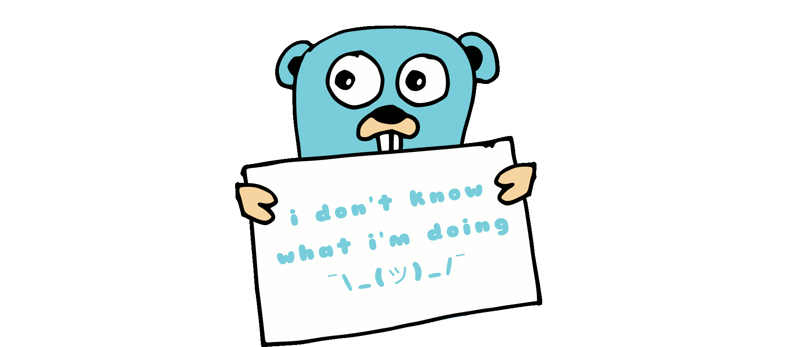

# Factorial Bogosort

## What is Bogosort?

Bogosort, also known as permutation sort, stupid sort, slow sort, shotgun sort or monkey sort is a particularly ineffective algorithm one person can ever imagine. It is based on generate and test paradigm. The algorithm successively generates permutations of its input until it finds one that is sorted.

## How does it work?

This is the worst algorithm ever.

First, it calculates the slice length factorial. The factorial represents all the ways that a queue can be organized - in this case, our slice.
Then, it literally opens one Goroutine for each possible order. Each Goroutine will generate an unique random order for the slice.

When any Goroutine satisfies the condition (ordered array), all subsequent Goroutines are canceled.

## Points of improvement

There are few improvements that can be made, but we all now that we SHOULD NOT IMPROVE SOMETHING THAT SHOULD NOT EXIST. I'll specify it anyway:

1. The random generator seeder

    This algorithm would perform really better if the random order generator didn't create repeted orderings.

2. Limit Goroutines

    Limiting the max number of Goroutines would prevent your computer from exploding when trying bigger slice lengths.

## Contributing

This project is an open-source project, and contributions from other developers are welcome. If you encounter any issues or have suggestions for improvement, please submit them on the project's GitHub page.